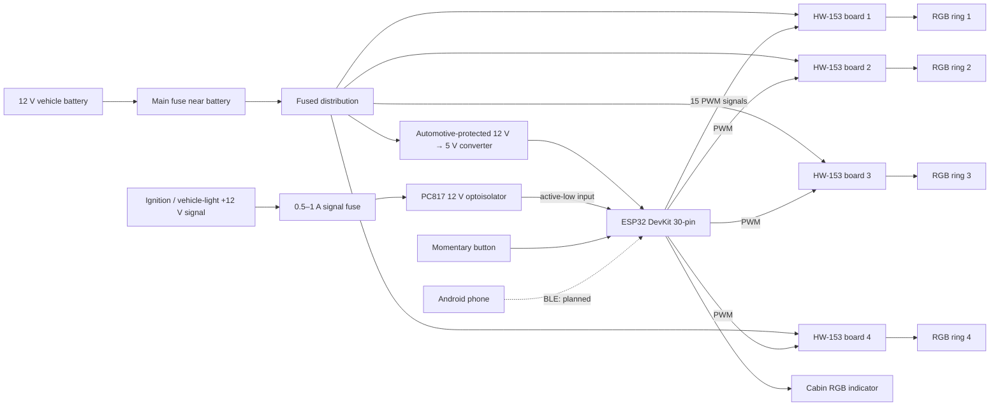
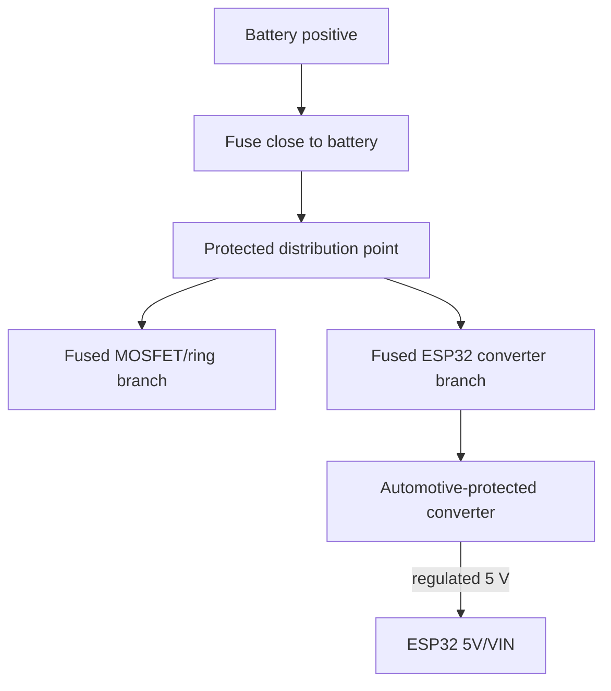

# D4WID Ring

Android-controlled RGB halo-ring controller for a pre-facelift 2013 Dodge Challenger. The system replaces an unreliable aftermarket RGB controller with an ESP32-based controller, independently drives four 12 V common-anode RGB rings, mirrors the active color inside the cabin, and can apply a configurable action when a 12 V vehicle signal becomes active.

> **Project status:** hardware prototype and interactive Android dashboard. The firmware provides favorite-color cycling, short/long physical-button handling, and an ignition/light-input override. Bluetooth synchronization is the next milestone.

## Repository layout

```text
ring-controller/
├── firmware/   ESP32 firmware (PlatformIO + Arduino)
├── mobile/     Android application (Kotlin + Jetpack Compose)
├── hardware/   pin map, bill of materials, and installation checklist
├── protocol/   versioned app ↔ ESP32 communication contract
├── docs/       architecture and project decisions
└── .github/    CI and tagged APK release automation
```

## System overview



## Known hardware

- ESP32-WROOM-32 30-pin DevKitC-style board with CH340 and USB-C.
- Four HW-153 V1.1 four-channel IRF540N optocoupled low-side MOSFET boards. One board is assigned to each RGB ring; its fourth channel remains spare.
- Four 12 V analog RGB rings with one common positive wire and separate R/G/B negative returns.
- One PC817/EL817 optoisolator module with a 12 V input and a 3.3 V-compatible transistor output.
- One momentary push button.
- One cabin RGB indicator; its exact electrical type still needs to be confirmed before final wiring.
- An automotive-protected 12 V → 5 V converter for the ESP32. Never connect the ESP32 directly to the battery.

## ESP32 pin allocation

The design uses 15 of the classic ESP32's 16 LEDC PWM channels. GPIO34 and GPIO35 are input-only pins and do not provide internal pull-up resistors.

| Function | Red | Green | Blue |
|---|---:|---:|---:|
| Ring 1 / HW-153 board 1 | GPIO25 (`D25`) | GPIO26 (`D26`) | GPIO27 (`D27`) |
| Ring 2 / HW-153 board 2 | GPIO32 (`D32`) | GPIO33 (`D33`) | GPIO4 (`D4`) |
| Ring 3 / HW-153 board 3 | GPIO13 (`D13`) | GPIO14 (`D14`) | GPIO16 (`D16`) |
| Ring 4 / HW-153 board 4 | GPIO17 (`D17`) | GPIO18 (`D18`) | GPIO19 (`D19`) |
| Cabin RGB indicator | GPIO21 (`D21`) | GPIO22 (`D22`) | GPIO23 (`D23`) |

| Input | GPIO | Electrical behavior |
|---|---:|---|
| Momentary button | GPIO34 (`D34`) | Active low; requires an external 10 kΩ pull-up to 3.3 V |
| Ignition/light optoisolator | GPIO35 (`D35`) | Active low; use the module's 3.3 V output-side supply/pull-up |

Avoid GPIO0, GPIO2, GPIO5, GPIO12, and GPIO15 because they are boot-strapping pins. Keep GPIO1/TX0 and GPIO3/RX0 available for USB serial diagnostics.

## Wiring one HW-153 board and one ring

Every black control connector is marked `S + -`:

```text
S  → assigned ESP32 GPIO
+  → ESP32 3V3
-  → ESP32 GND
```

The three channels for a ring are wired as follows:

```text
ESP32 GPIO (red)   → CH1 S     CH1 controls M2-
ESP32 GPIO (green) → CH2 S     CH2 controls M3-
ESP32 GPIO (blue)  → CH3 S     CH3 controls M4-

ESP32 3V3 → CH1/CH2/CH3 +
ESP32 GND → CH1/CH2/CH3 -
```

The 12 V side is low-side switched:

```text
Fused +12 V supply → M1+
Vehicle ground     → M1-

Ring common +      → M1+ (or a verified common output + terminal)
Ring red return    → M2-
Ring green return  → M3-
Ring blue return   → M4-
M5 / CH4           → unused spare
```

Verify with a continuity meter, while fully unpowered, that the board's output `+` terminals are common with `M1+` before relying on them. If a ring has a common negative rather than a common positive, this wiring and board topology are not suitable without redesign.

Repeat the same mapping for boards 2–4 using the GPIO table above.

## 12 V signal input

The optoisolator converts the selected vehicle signal into a safe ESP32 input:

```text
Vehicle side                         ESP32 side
------------                         ----------
Ignition/light +12 V → INPUT+        VCC → ESP32 3V3
Vehicle ground       → INPUT-        OUT → GPIO35
                                      GND → ESP32 GND
```

Add a 0.5–1 A fuse close to the signal tap. Do not connect 12 V to `OUT`, `VCC`, or any ESP32 pin. When the 12 V signal is active, the module pulls GPIO35 low.

Do not add an extra wire that bridges the input and output grounds across the optoisolator. Note that a normal non-isolated automotive buck converter already ties ESP32 ground to vehicle ground, so the finished vehicle installation is not fully galvanically isolated. The optoisolator still performs essential voltage translation and limits fault propagation into the GPIO.

The vehicle signal may be PWM-controlled or may contain bulb-diagnostic pulses. Firmware must debounce/filter it before changing the lights.

## Momentary button

GPIO34 has no internal pull-up:

```text
ESP32 3V3 ── 10 kΩ ── GPIO34
                         │
                    momentary button
                         │
                      ESP32 GND
```

The current default behavior is:

- Short press while off: turn on using the current favorite color.
- Short press while on: advance to the next favorite.
- Hold for 850 ms: turn the user lighting off.

These rules run on the ESP32 without a phone. The Android app will make the favorite list and button actions configurable after BLE synchronization is implemented.

## Cabin RGB indicator

GPIO21, GPIO22, and GPIO23 are reserved for the cabin indicator. Do not connect a bare LED or a 12 V illuminated switch until its common-anode/common-cathode type, forward voltage, built-in resistors, and current are confirmed.

- A bare low-current RGB LED requires one current-limiting resistor per color.
- A 12 V RGB indicator requires a suitable driver; it must not be powered from an ESP32 GPIO.
- An addressable LED can reduce the indicator to one GPIO, but that is not the current pin plan.
- One RGB indicator cannot represent four different ring colors simultaneously. It mirrors the shared solid color and follows Ring 1 during independent colors or effects.

## Power and automotive safety



- An automotive system is approximately 12 V with the engine off and commonly around 14 V while charging; it can also produce short positive and negative transients.
- Use an automotive-rated or adequately protected converter with reverse-polarity and transient protection. A generic exposed LM2596 board is not a complete automotive front end.
- Install a main fuse near the battery and individually fuse downstream branches.
- Determine fuse sizes and wire gauges from measured ring current. Do not use optimistic marketplace current ratings as the design value.
- Mount electronics in a ventilated, electrically insulated enclosure away from moisture and heat.
- This is an experimental accessory controller. Do not rely on it as mandatory road lighting and ensure the installed lighting complies with local regulations.

## Safe bring-up sequence

1. Keep the vehicle disconnected. Use a current-limited 12 V bench supply.
2. Power the ESP32 from USB and test its firmware without the 12 V side.
3. Connect one HW-153 board and one ring only.
4. Confirm the ring has a common positive and identify R/G/B returns.
5. Start with a conservative current limit, then verify red, green, blue, and white.
6. Confirm all outputs are off during ESP32 reset and boot.
7. Add the remaining rings one at a time.
8. Test the PC817 input with a fused bench 12 V signal.
9. Only after bench validation, install fused branches in the vehicle.

See [hardware/BOM.md](hardware/BOM.md), [hardware/PINOUT.md](hardware/PINOUT.md), and [hardware/INSTALLATION_CHECKLIST.md](hardware/INSTALLATION_CHECKLIST.md) for condensed working references.

## Software

### Firmware

```bash
python3 -m pip install platformio==6.1.19
pio run -d firmware
pio run -d firmware -t upload --upload-port /dev/cu.usbserial-10
pio device monitor -d firmware --port /dev/cu.usbserial-10
```

### Android

The Android app uses Kotlin, Jetpack Compose, minimum Android 8.0 (API 26), and application ID `it.letscode.ringcontroller`. Its Drive, Scenes, and Config tabs are available in English and Polish, selected automatically from the Android system language.

```bash
cd mobile
./gradlew :app:assembleDebug
```

The debug APK is written to `mobile/app/build/outputs/apk/debug/`.

## Releases

Continuous integration builds the firmware and Android debug APK for pushes and pull requests. A tag matching `v*` builds a signed release APK and publishes it to GitHub Releases:

```bash
git tag v0.1.0
git push origin v0.1.0
```

The release workflow requires these repository secrets:

- `ANDROID_KEYSTORE_BASE64`
- `ANDROID_KEYSTORE_PASSWORD`
- `ANDROID_KEY_ALIAS`
- `ANDROID_KEY_PASSWORD`

The signing key must be backed up permanently. Losing it prevents future APKs from updating an already installed copy.

## Planned behavior

- Independent color and brightness for all four rings.
- Solid colors, synchronized effects, and per-ring animations.
- Editable physical-button favorites and configurable short/multiple/long press actions.
- Configurable 12 V input automation, including force-white, apply preset, restore previous state, turn off, or ignore.
- Settings stored in ESP32 non-volatile storage so automation works without the phone.
- BLE configuration and control from the Android app.
- Optional deep sleep/wake strategy to minimize parked-vehicle battery drain.
