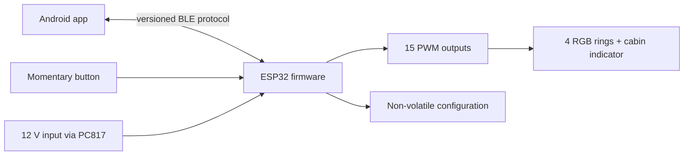

# Architecture

## Responsibility split

The ESP32 is authoritative for light state, physical inputs, safety defaults, saved presets, and ignition/light automation. The Android app is a configuration and control client. Losing the BLE connection must not disable the physical button or the configured vehicle-signal behavior.



## Firmware layers

1. **Hardware abstraction** — pin map, PWM polarity, debounced digital inputs.
2. **Light engine** — RGB values, ring groups, 20 built-in effects, eight persisted custom timelines, brightness, and cabin indication.
3. **State machine** — user enable state, temporary overrides, and restoration behavior.
4. **Configuration** — values and executable custom-scene timelines persisted to ESP32 NVS; human-readable custom names/descriptions stay in Android preferences.
5. **Transport** — versioned BLE GATT service with command writes and authoritative state notifications.

Priority order for output decisions:

```text
safety/off > active vehicle-signal override > physical-button state > app-selected effect
```

The exact priority policy will become configurable only where doing so remains deterministic and safe.

Default physical-button behavior is an 850 ms hold to turn user lighting off and a short press to restore a uniform saved solid color or advance through the favorites. If a built-in/custom scene is active or saved solid colors differ, the short press first stops the effect and forces fallback ice white on all four rings; the next press continues after white in the favorite cycle. The favorite cycle and button actions are stored and executed on the ESP32.

The cabin RGB indicator mirrors both hue and global brightness only for a uniform solid state. A scene or mixed solid colors instead produce a repeating full-brightness amber double flash followed by a long pause. Off state suppresses the indicator, while the higher-priority vehicle override shows its actual forced-white output. This policy intentionally exposes an outside-lighting state that should be normalized with the physical button before driving.

## Android layers

1. Compose UI.
2. View models and immutable screen state.
3. Ring Controller domain models.
4. BLE manager and protocol codec with scanning, reconnect, MTU negotiation, command throttling, and state synchronization.
5. Local cache for UI convenience; ESP32 remains authoritative.

Custom scenes use a small shared keyframe model: 2–12 cyclic moments, four RGB colors per moment, `150..5000` ms duration, and either smooth interpolation or a held jump. Android provides the editor and uploads definitions as a transactional `CUSTOM_BEGIN` / `CUSTOM_STEP` / `CUSTOM_COMMIT` sequence through its serialized GATT write queue. ESP32 validates the complete staging buffer before replacing an NVS slot, so a disconnected or partial upload cannot corrupt the previously saved scene.

## Release model

- Pull requests and pushes build firmware and a debug APK.
- A `v*` tag builds a signed APK and publishes it to GitHub Releases.
- The Android signing key is stored outside Git and injected through GitHub Actions secrets.
