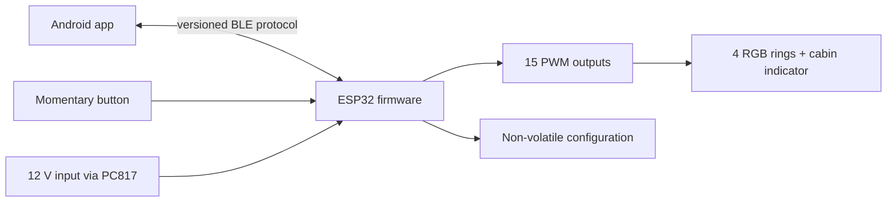

# Architecture

## Responsibility split

The ESP32 is authoritative for light state, physical inputs, safety defaults, saved presets, and ignition/light automation. The Android app is a configuration and control client. Losing the BLE connection must not disable the physical button or the configured vehicle-signal behavior.



## Firmware layers

1. **Hardware abstraction** — pin map, PWM polarity, debounced digital inputs.
2. **Light engine** — RGB values, ring groups, effects, brightness, and cabin indication.
3. **State machine** — user enable state, temporary overrides, and restoration behavior.
4. **Configuration** — values persisted to ESP32 NVS.
5. **Transport** — versioned BLE service (planned).

Priority order for output decisions:

```text
safety/off > active vehicle-signal override > physical-button state > app-selected effect
```

The exact priority policy will become configurable only where doing so remains deterministic and safe.

## Android layers

1. Compose UI.
2. View models and immutable screen state.
3. Ring Controller domain models.
4. BLE repository and protocol codec (planned).
5. Local cache for UI convenience; ESP32 remains authoritative.

## Release model

- Pull requests and pushes build firmware and a debug APK.
- A `v*` tag builds a signed APK and publishes it to GitHub Releases.
- The Android signing key is stored outside Git and injected through GitHub Actions secrets.

